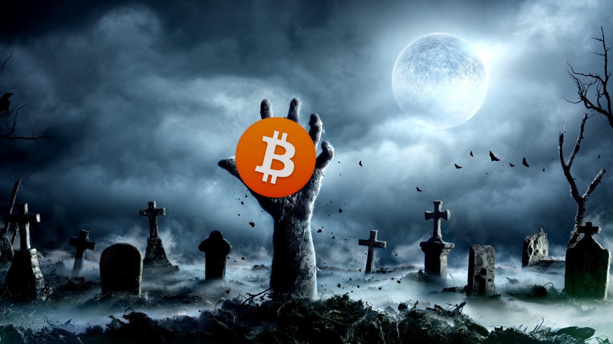
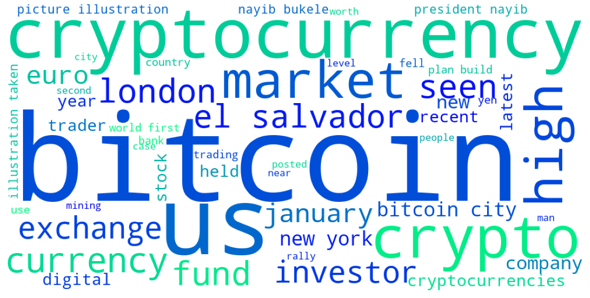
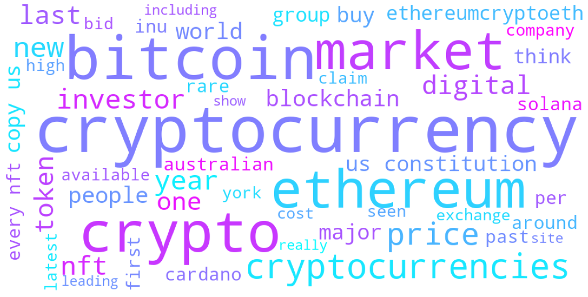
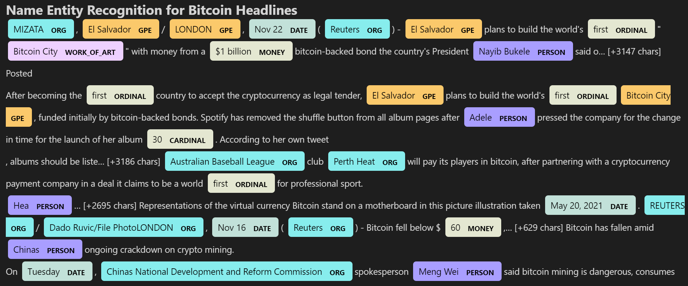
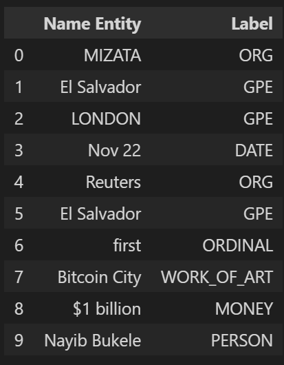
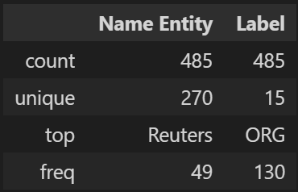
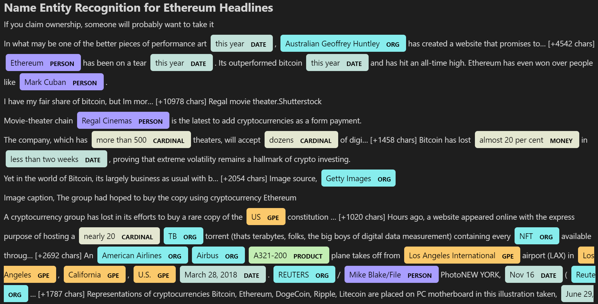
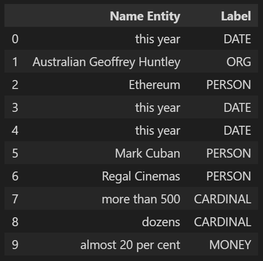
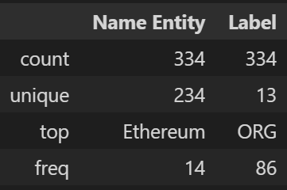

# Tales From the Crypto

In this assignment, I have applied natural language processing to understand the sentiment in the latest news articles featuring Bitcoin and Ethereum. This should help expand our understanding of other factors involved in the behavior of coin prices, such as common words and phrases, and organizations and entities mentioned in the articles. All news articles have been pulled from [newsapi](https://newsapi.org/).

Here are the main language processing techniques used:

1. [Sentiment Analysis](#1---Sentiment-Analysis)
2. [Natural Language Processing](#2---Natural-Language-Processing)
3. [Named Entity Recognition](#3---Named-Entity-Recognition)

## Files

[Completed Notebook](crypto_sentiment.ipynb)

## Sentiment Analysis

### Which coin has the Highest Mean Positive Score?

> ETH, with a mean positive score of 0.064550

### Which coin has the Highest Negative Score?

> BTC, with a max negative score of 0.229000

### Which coin had the Highest Positive Score?

> ETH, with a max positive score of 0.299000

### Which coin had the highest compound score?

> BTC, with a max compound score of 0.857300

## Natural Language Processing

### N-grams

#### *Bitcoin: Top 10 words*

|Word | Count |
|---|---|
|bitcoin | 43|
|cryptocurrency | 19|
|crypto | 13|
|new | 13|
|world | 12|
|president | 12|
|city | 11|
|el | 10|
|salvador | 10|
|market | 10|

#### *Ethereum: Top 10 words*

| Word | Count |
|---|---|
| cryptocurrency | 30 |
| bitcoin | 26 |
| crypto | 23 |
| ethereum | 20 |
| market | 20|
| cryptocurrencies| 19  |
| price | 15|
| year | 12|
| nft | 12 |
| new | 12 |

Note: lemmatizer was not able to lemmatize "cryptocurrencies"

### Bitcoin World Cloud

### Ethereum World Cloud

## Named Entity Recognition

### Bitcoin

Spacy visualization:

Top 10 list of entities:

Details about list of entities:

### Ethereum

Spacy visualization:

Top 10 list of entities:

Details about list of entities:

